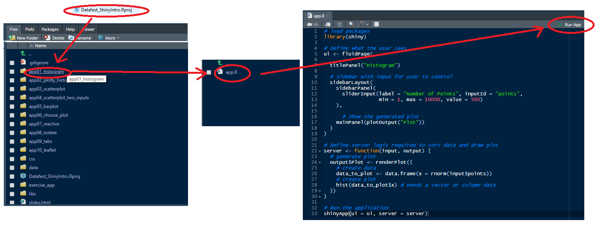

# Introduction to Interactive Data Visualisation in R Workshop Materials

This repository contains all the materials needed for the Introduction to Data Visualisation in R workshop, held at Inverness College as part of the [Fringe](https://www.datafest.global/fringe-events) events for [Datafest 2020](https://www.datafest.global/).

You can run the code by clicking on the button below to launch a [binder](https://mybinder.org/), created via the [holepunch](https://karthik.github.io/holepunch/index.html) package.

<!-- badges: start -->
[](https://mybinder.org/v2/gh/aj2duncan/Datafest_DataVisWorkshop/master?urlpath=rstudio)
<!-- badges: end -->

Or you can install everything on your own machine.

## Installation

### What you need

First you need to have [R](https://cran.r-project.org/) installed. It is also suggested that you install [RStudio](https://rstudio.com/products/rstudio/download/#download) as it generally makes things a little easier. Once these are installed you need to add some additional packages. Packages give **R** some additional functionality. To run all the *shiny apps* included herein you'll need the following packages installed.

- [shiny](https://shiny.rstudio.com/)
- [plotly](https://plot.ly/r/)
- [dplyr](https://dplyr.tidyverse.org/)
- [readr](https://readr.tidyverse.org/)

You can install all of these packages at once using the following line of code.

```r
install.packages(c("shiny", "plotly", "dplyr", "readr"), dependencies = TRUE)
```

If you want to modify the presentation you will also need the [xaringan](https://github.com/yihui/xaringan) package installed.

```r
install.packages("xaringan", dependencies = TRUE)
```

### Shiny Applications

The easiest way to work with these materials is to open the RStudio project. This will allow you to easily see the folders in RStudio. Each folder contains a file `app.R` which contains the code for a [shiny](https://shiny.rstudio.com/) application. You can then open these in RStudio and then you can click on the `Run App` button to run the application. The image below should give you some idea of the process.



## Data

The majority of the data used in these applications are built into the additional packages. The exception is historic Met Office data, from the Cambridge, Eastbourne, Nairn and Tiree weather stations. The data is available for download from the Met Office - [https://www.metoffice.gov.uk/research/climate/maps-and-data/historic-station-data](https://www.metoffice.gov.uk/research/climate/maps-and-data/historic-station-data).

## Funding

The production of all the materials for this workshop was funded through ESIF.


