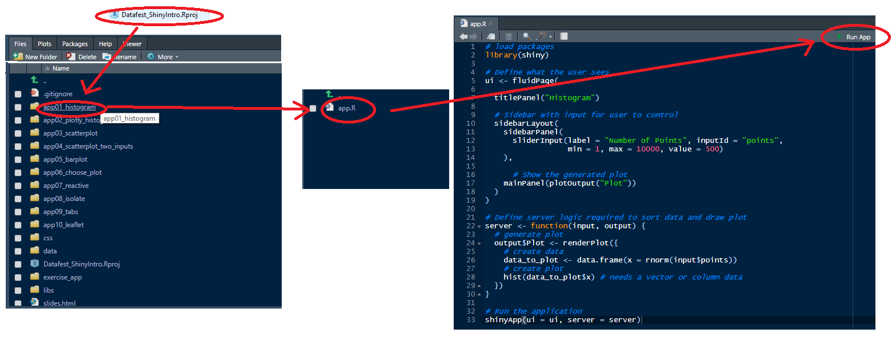

```{r setup, include=FALSE}
options(htmltools.dir.version = FALSE)
knitr::opts_chunk$set(echo = TRUE, eval = FALSE, warning = FALSE,
                      message = FALSE, comment = NA)
library(tidyverse)
theme_set(theme_gray(base_size = 18))
```


# Welcome

- Housekeeping

- Computers

- ...

---
# Plan for the afternoon

```{r, out.width = "50%", eval = TRUE, echo = FALSE, fig.align = 'center'}
knitr::include_graphics("https://raw.githubusercontent.com/rstudio/hex-stickers/master/PNG/shiny.png")
```

Image Source: https://raw.githubusercontent.com/rstudio/hex-stickers/master/PNG/shiny.png
---
# R

- Open source statistical software

- [RStudio](https://rstudio.com/) is an IDE that helps make `R` easier to use

- **Shiny** is an add on package turns `R` code into web applications.

--

-  My experience with Shiny:

- Built shiny apps for both internal and external use

- External: Online calculators/Teaching tools

- Internal: Automated Reporting 

---
# Today

- Interactive plots using [plotly](https://plot.ly/r/) package.

- Controlling User input.

- Reactivity

--

- Some apps to work with (and others for later)

- A larger app for you to build

---
# A Shiny App

Single `app.R` file

```{r}
# load packages
library(shiny)

# Define what the user sees
ui <- fluidPage(
  # what the user sees
)

# Define server logic required to sort data and draw plot
server <- function(input, output) {
  # what actually does the work behind the scenes
}

# Run the application 
shinyApp(ui = ui, server = server)
```

---
# A Shiny App

```{r}
# load packages
library(shiny)

# Define what the user sees
ui <- fluidPage(
  # Sidebar with input for user to control 
  sidebarLayout(
    sidebarPanel(
      sliderInput(label = "Number of Points", inputId = "points",
                  min = 1, max = 10000, value = 500)
    ),
    # Show the generated plot
    mainPanel(plotOutput("Plot"))
  )
)

# Define server logic required to sort data and draw plot
server <- function(input, output) {
  output$Plot <- renderPlot({ hist(rnorm(input$points)) })
}

# Run the application 
shinyApp(ui = ui, server = server)
```


---
# A Shiny App

```{r}
# load packages
library(shiny)

# Define what the user sees
ui <- fluidPage(
  # Sidebar with input for user to control 
  sidebarLayout(  #<<
    sidebarPanel( #<<
      sliderInput(label = "Number of Points", inputId = "points", #<<
                  min = 1, max = 10000, value = 500) #<<
    ),
    # Show the generated plot
    mainPanel(plotOutput("Plot")) #<<
  )
)

# Define server logic required to sort data and draw plot
server <- function(input, output) {
  output$Plot <- renderPlot({ hist(rnorm(input$points)) })  #<<
}

# Run the application 
shinyApp(ui = ui, server = server)
```

---
class: inverse, center, middle

# Let's Get Started

### Open RStudio and we'll begin with a tour


---
# Opening an App

```{r, out.width = "100%", eval = TRUE, echo = FALSE, fig.align = 'center'}

```
---
# App01 Histogram

- Pretty much be as earlier slide. 

- Click **Run App**.

- Move the slider, what happens.

--

- **Exercise:** Change the minimum value of the slider to 100 and the starting value to 1000

---
# App02 Plotly Histogram

Some new things (for the most part replacing `plot` with `plot_ly`)

```{r}
library(plotly)
```

```{r}
mainPanel(plotlyOutput("Plot"))
```

```{r}
output$Plot <- renderPlotly({ ... })
```

```{r}
plot_ly(data_to_plot, x = ~x, type = "histogram")
```

--

- **Exercise:** Change name of the plot to *Plotly*. Where do you need to make the changes?

- Feel free to make other changes too.


---
# App03 Scatterplot

- Uses `plotly` and a built in dataset to `R` - `diamonds`.

- Slider controls number of points to plot.

- We sample from the dataset.

- Before you move the slider, what do you expect to happen.

--

- **Exercise:** Instead of colouring by *cut*, use the variable *clarity*. 

---
# App 04 Two Inputs

- Now we can add another input

- `selectizeInput()` allows more than one value

- Change the *cut* selection and change the slider - what happens?

--

- **Exercise**: Create a vector of choices using:

```{r}
cut_choices <- c("Fair", "Good", "Very Good", "Premium", "Ideal")
```

and replace the vectors in `selectizeInput()` with it. Where should it go?

---
# App 05 Barplot

- Keeping the two inputs we can use a boxplot.

- **Note:** You'll see that we have changed the `x = ~` to a different variable.

--

- **Exercise**: What would happen if you remove `color = ~cut`? Find out. Can you change the default single colour? *Hint: `color = I("pink")`*. 

---
# App 06 Choose Plots

- Alternatively we can let the user choose how to display the data.

- We now have another input - `selectInput()` and 

```{r}
# draw correct plot
if (input$plot_type == "Boxplots") { #<<
  # draw boxplots
  plot_ly(data = diamonds_to_plot, x = ~cut, y = ~price, color = ~cut,
          type = "box")
} else {  #<<
  # draw scatterplot
  plot_ly(data = diamonds_to_plot, x = ~carat,
          y = ~price, color = ~cut, type = "scatter", mode = "markers")
  
} #<<
```

--

- **EXercise:** Change things so that the code checks if `input$plot_type == "Scatterplot"` it draws a scatterplot `else` it draws a boxplot.

---
class: center, middle

# Reactivity

## A Quick Aside

---
# Reactivity

- Was the last app well designed? 

- What if you wanted to change the type of chart *and* the cut *and* the number of points?

- How many graphs did it draw?

--

- Unless told otherwise shiny listens all the time.

- We need to *isolate()* the bits we don't want to listen too.

---
# App 07 Reactivity

- Have changed the inputs to

```{r}
# gather info from user but only when asked
num_diamonds <- isolate(input$diamonds)
types_cut <- isolate(input$cut)

# listen to go button
input$go
```

- **Note:** The type of chart is not isolated - chart type will change straight away.

--

- **Exercise:** `isolate()` the type of chart. 

--

- **Extras:** There are many other ways to display shiny apps. I have created two additional apps

    - `extras_app10_tabs`: Uses a different tab for each plot
    - `extras_app11_tabs_reactive`: Similar to `extras_app10_tabs` but it removes a lot of repetitive code.


---
# App 08 Reading in Data

- Last thing we're going to look at today (before trying one yourself) is doing this with your own data.

- Ideally in csv format and rectangular (with column names without spaces)

- Use `read_csv("filename.extenxion)` and remember to load `readr` package too.

--

- **Note:** Now using the `sliderInput()` but with **2** values. This creates a two slider values to move. 

--

- **Exercise:** Add come code to the `plot_ly()` command to change the colour of the boxplot depending on the *location*.

---
class: center, middle

# Your turn ... 

---
# Your Turn

- Open the `exercise_app` folder and then `app.R`.

- Feel free to copy and paste code from earlier apps.

--

- **Task 1**: Read in `weather.csv` and create boxplots of *sun* for each location.

- **Task 2**: Add a `selectizeInput()` to choose location.

- **Task 3**: Add an additional plot. *sun* vs *date* as a *scatterplot*. 

- **Task 4**: `isolate()` all the inputs. 

- **Task 5**: By investigating the extra apps, try to display the two plots in 


